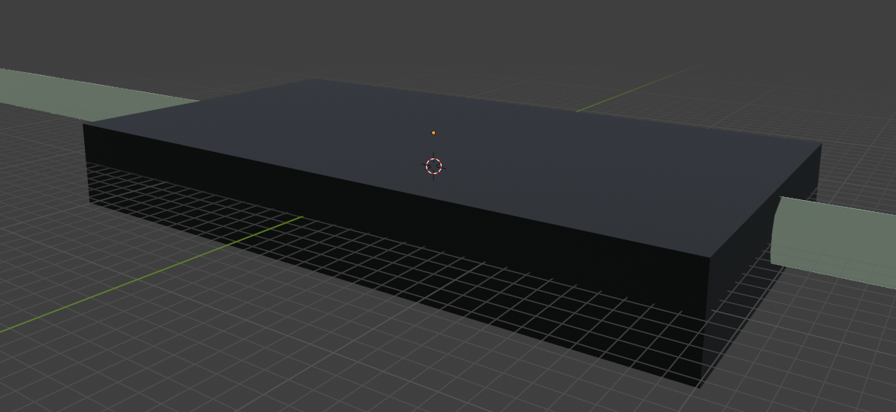
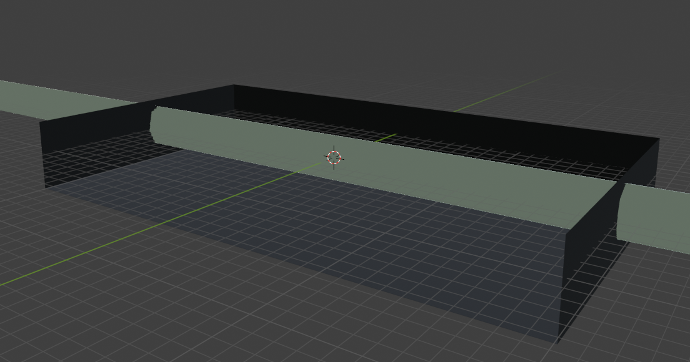
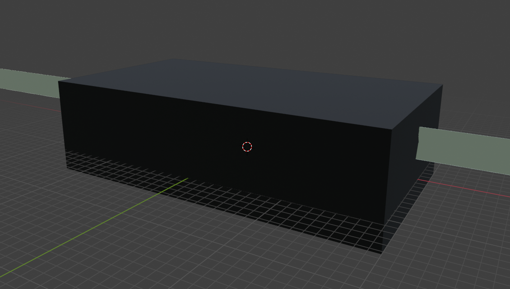
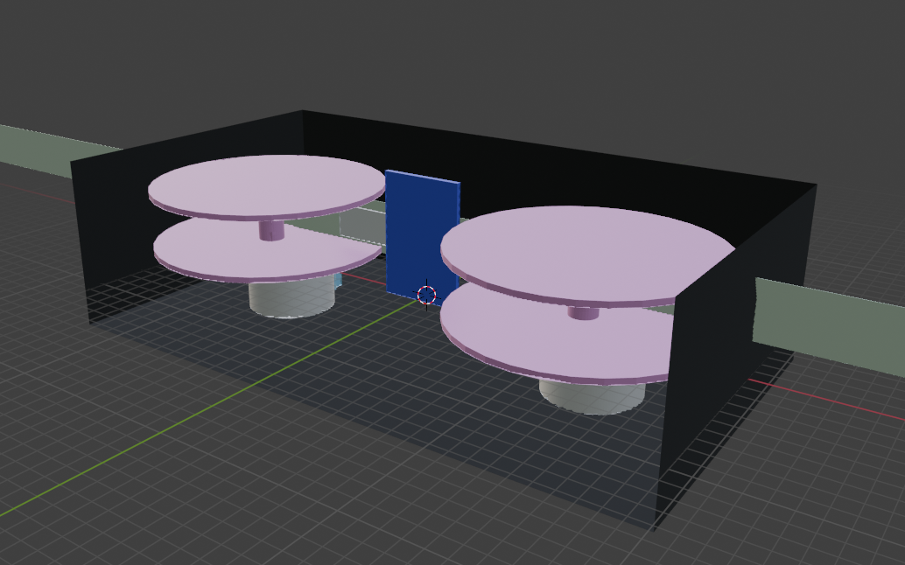
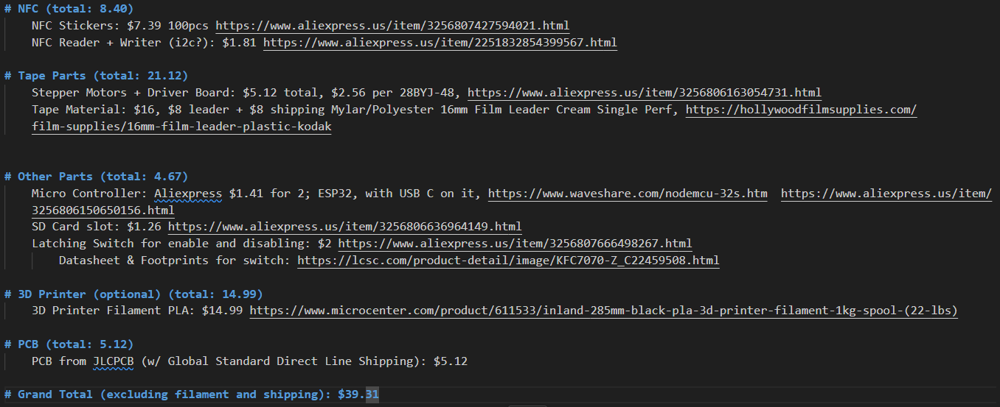
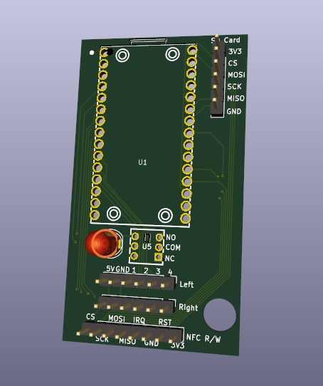
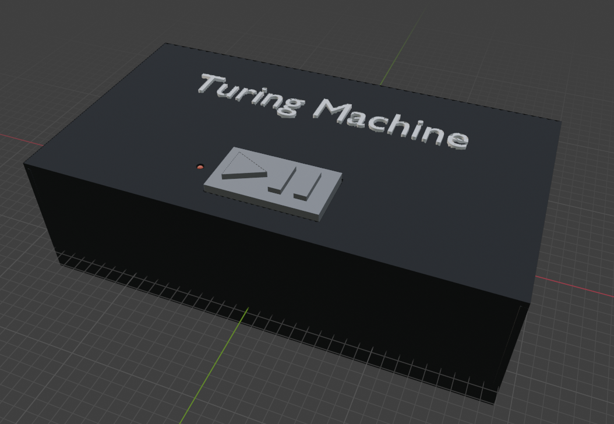
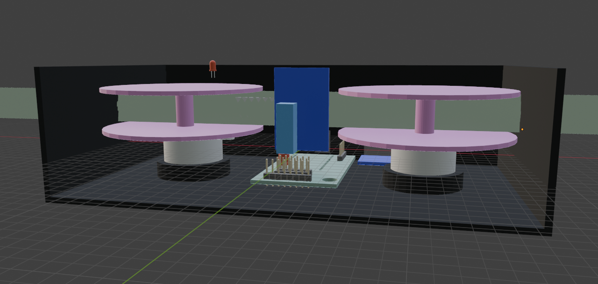

# Tuesday 7/1/2025
> I was setting up Hackatime for Blender getting ready to make the PCB case. I had the general idea to make it look like a VHS Tape
RealLifeTuringMachine: 12m 55s
VHS_Container: 4m 36s
Blender-VHS_Container: 2m 30s
Blender-TuringMachineCAD_Models: 2m 21s
> 22 minutes spent

# Wednesday 7/2/2025
> I spent the entire day making the Case for the turing machine. I was looking up parts to use for my build and I found most of them. I found the stepper motors I want to use, imported them into blender and modeled them into the case. I mostly found amazon links to all my parts. I also had to make my case bigger, making it close to twice the width of a real VHS because the tape needs to be on the stepper motor, and the motors are kinda tall.
RealLifeTuringMachine: 2h 12m 55s
> 2 hrs and 12 minutes spent

# Thursday 7/3/2025
> I worked on the PCB's schematic after finding all the parts yesterday. I had to find a micocontroller, and an sd card reader. When I found them I made the symbols for them and then added them to the schematic
PCB: 1hr 47m 42s
RealLifeTuringMachine: 55m 9s
ESP32_OnlineDevBoard: 19m 12s
SD_Card_Amazon: 10m 31s
> 3 hrs and 12 minutes spent

# Friday 7/4/2025
> I finalize the PCB by turning the schematic into a PCB, and got quoted at JLCPCB for 5.12 w/ shipping. I also went through all the BOM links and tried to get them for cheaper. I found many aliexpress parts to use instead of amazon parts. I then wrote the code for the esp32 to have the Turing Machine logic (in Code/TuringMachineCode/TuringMachineCode.ino).
RealLifeTuringMachine: 2h 32m 12s
PCB: 34m 10s
> 3 hrs and 6 minutes spent

# Saturday 7/5/2025
I finished up the case model by adding supports for some parts like the stepper motor and the latching switch. I also added the button at the top, the LED in the case, holes for the SD card & USB C, and the text at the. I also exported all the things from blender to stls for 3d printing.
RealLifeTuringMachine: 2h 12m 51s
> 2hrs and 31 minutes spent

# Total time spend:
11h 2m (according to hackatime)