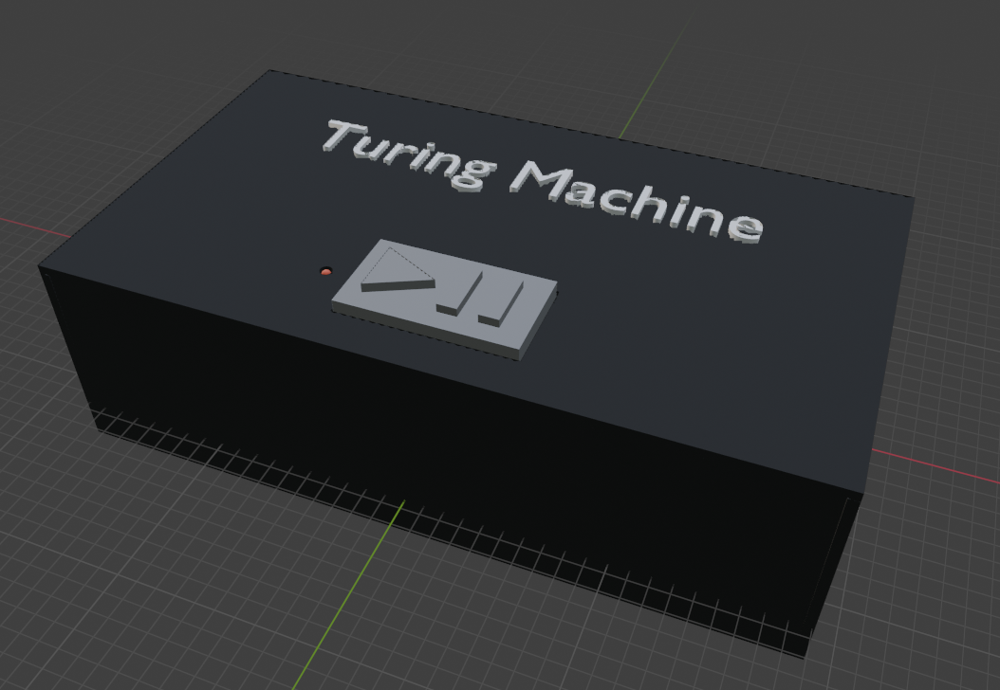
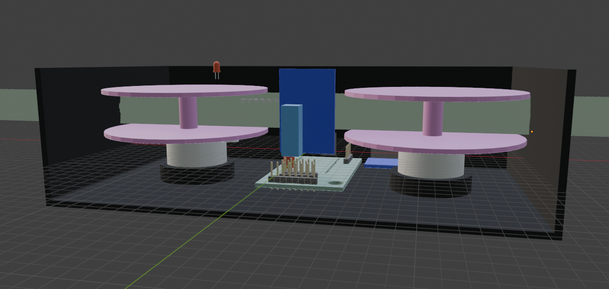

# Real Life Turing Machine
This is a real, physical, and working Turing Machine using an ESP32, off the shelf i2c components, and NFC tags. The Turing machine seems like the lowest level and most basic form of hardware imaginable, so I wanted to try my hand at making one in real life!

# Images

# Hackatime project name(s)
- RealLifeTuringMachine (8h 31m) TODO: Update this time before submitting
- PCB (2h 23m)
- ESP32_OnlineDevBoard (19m)
- SD_Card_Amazon (10m)
- VHS_Container (4m)
- Blender-VHS_Container (2m)
- Blender-TuringMachineCAD_Models (2m)

# BOM (Check BOM.md for a more in depth bill of materials)
- NFC Stickers
- NFC Reader & Writer Module
- 2x 28BYJ-48 Stepper Motors & Driver boards
- 50ft to 100ft Mylar/Polyester 16mm Film Leader
- ESP32
- SD Card Breakout Board + SD Card (optional)
- Latching Switch 6 Pin
- 3D Printer filament if 3d printing the case
- 3mm LED
- PCB to house all the electronics

TODO: Fill out the checklist and submit
